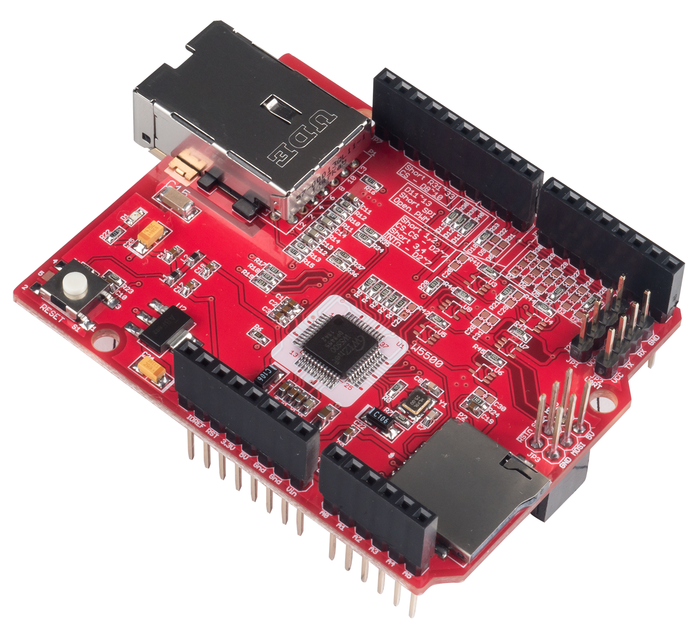
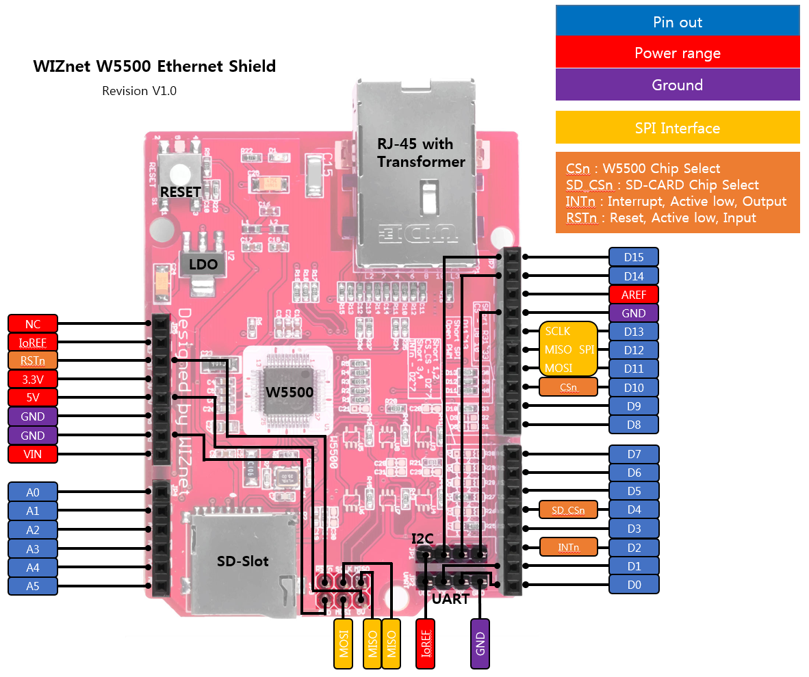
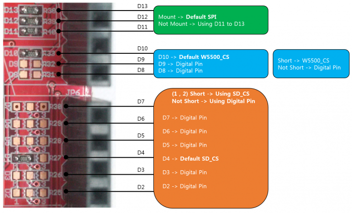
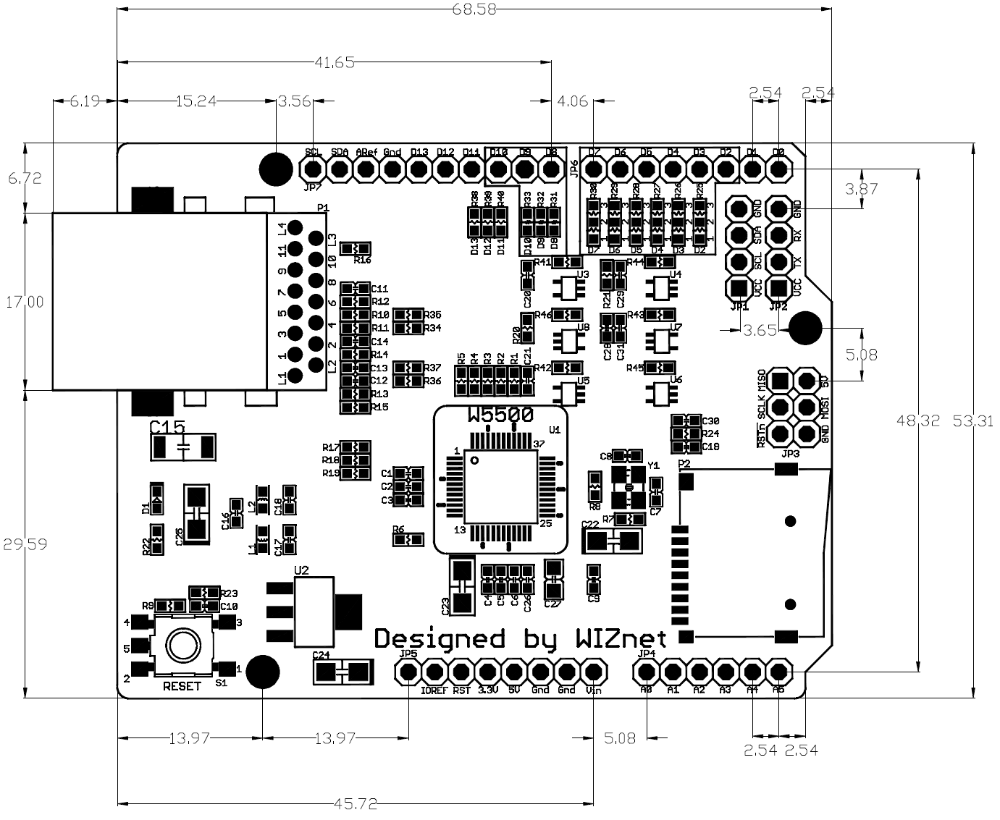

# W5500 Ethernet Shield

## Overview

- Arduino Pin-compatible
- ARM mbed compatible operation
- Ethernet (W5500 Hardwired TCP/IP chip)

W5500 Ethernet shield is designed using the WIZnet W5500 chip. Please click the link for the further information about W5500. It supports both 3.3V & 5V. This Ethernet Shield is compatible with Arduino and ARM mbed Platform.

### Available Board List

- ARM mbed Board
	- ARM mbed Platform : ARM mbed platform Site
	- FRDM-KL25Z : Freescale
	- NXP LPC800-MAX : NXP
- Arduino Board
	- Arduino board (e.g. the Uno, Mega, Due)
	- Arduino Leonardo
- Arduino-compatible Board
	- Seeeduino v3.0 : Based on Arduino Duemilanove

## Getting Started

- [Getting Started fot Arduino](https://wizwiki.net/wiki/doku.php?id=osh:w5500_ethernet_shield_getting_started#step_2installing_the_ethernet2_library)
- [Ethernet/Ethernet2 library Reference](https://www.arduino.cc/en/Reference/Ethernet)

## Feature

- Ethernet controller W5500 of WIZnet
- SPI interface
- Internal 32Kbytes Tx/Rx buffer
- 10/100 Ethernet PHY embedded
- Hardwired TCP/IP Protocols : TCP, UDP, ICMP, IPv4, ARP, IGMP, PPPoE
- User Selectable GPIO pin
- Support SD-card slot for storage
- Support 3.3V and 5V

## Hardware Configuration
- RJ-45 with Transformer : Ethernet Port
- W5500 : a Hardwired TCP/IP Ethernet Controller
- RESET : Reset Ethernet shield and Arduino when pressed
- SD-Slot : support Micro SD card in FAT16 or FAT32 ; (Please read 'Caution' below)

## Pins usage on Arduino & ARM mbed

W5500 Ethernet shield has several configurable GPIOs

- When you operate it with other modules, you may need to change 'Chip Select' pin to a different one.
- W5500 INTn pin is linked to D2 (2,3 Short). So, if you need INTn pin. You soldering to 0R Resistor to Dx pin

**Caution)** When the user uses 5V Platform, we cannot confirm a stable operation of SD-CARD. Therefore, though 5V Platform is safe to use after going through enough tests, it is highly recommended to mount buffer & 100nF Capacitor for a secure operation.

## SPI Operation & Timing Diagram

There is a W5500 inside W5500 Ethernet shield. Therefore SPI operation & Timing Diagram of Ethernet shield follows one of W5500. For more information about W5500 chip please also refer to the chip's datasheet:

- [W5500 Wiki](https://wizwiki.net/wiki/doku.php?id=products:w5500:start)

## Dimension

